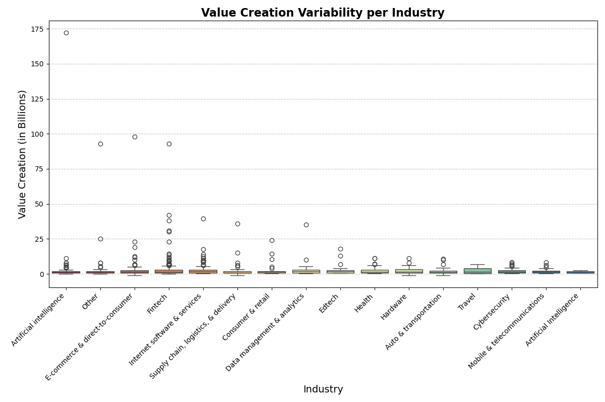

# chris_moreira_mini_project_IDS720

Project Requirenments: 
Project #1: Continuous Integration using Gitlab Actions of Python Data Science Project

The project structure must include the following files:
-- Jupyter Notebook with -- 
-> Cells that perform descriptive statistics using Polars or Panda.
-> Tested by using nbval plugin for pytest
-- Makefile with the following --
-> Run all tests (must test notebook and script and lib)
-> Formats code with Python blackLinks to an external site.
-> Lints code with RuffLinks to an external site.
-- Installs code via:  pip install -r requirements.txt
-> test_script.py to test script
-> test_lib.py to test library
-> Pinned requirements.txt
-> Gitlab Actions performs all four Makefile commands with badges for each one in the README.md

<< Data Description for all variables in my Dataset >>
Company: Company name
Valuation: Company valuation in billions (B) of dollars
Date Joined: The date in which the company reached $1 billion in valuation
Industry: Company industry
City: City the company was founded in
Country: Country the company was founded in
Continent: Continent the company was founded in
Year Founded: Year the company was founded
Funding: Total amount raised across all funding rounds in billions (B) or millions (M) of dollars
Select Investors: Top 4 investing firms or individual investors (some have less than 4)

<<<<<<< HEAD
<< Objective of Project >>
- Input: csv file 
- Output: working & tested function that produces the chart below & statistics pertinent to the variability of value creation in my dataset

<< How is value creation produced on a dataset for the Unicron company Data >> 
Value Creation = Current Valuation of Unicorn Company - Funding Amount
Both valuation and funding are computed in the USD currency 

<< Image for the Chart Produced by Main File >>

Note that this computed the variability of value creation for each industry presented in our raw data. 

<< Summary Statistics >>
Mean of Value Creation (in billions): 2.921073446327684
Median of Value Creation (in billions): 1.524
Standard Deviation of Value Creation (in billions): 8.133136697911187
=======

>>>>>>> c3a0168712df93493226d46e672c86e01455a4ab
